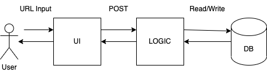
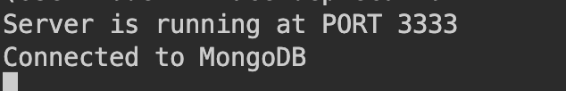

# MiniURL

Furious with copy pasting long URLs? Fret Not! With [miniUrl](https://mini-url-app.onrender.com), you can generate short and sweet URLs with the click of a button!

## How to use

1. Type or copy-paste the URL of your choice into the text box. Make sure the URL is of either http:// or https:// protocol, and is included in the input.
2. Click **SUBMIT**
3. Click your newly generated MiniURL, or copy it to save somewhere else!

Note: If it takes awhile to generate the URL on the website, do wait for about a minute as Render sets a response delay when the app has been inactive.

## Assumptions

1. The user must include http:// or https:// in their URL

## Architecture

A **client-server** architecture was utilized

1. Users will interact with the React UI frontend, inputting their URL
2. URL is sent to Node.js backend, where it will be processed.
3. \[Extension\] The URL is stored in a MongoDB database to ensure consistency in MiniURLs
4. Generated/retreived MiniURL is sent back from backend, appearing in the UI for the user to click/copy

## Instructions on running locally

### Prerequisites

1. Ensure you have the latest version of Node.js installed in your system.
2. Create a MongoDB Atlas account [here](https://www.mongodb.com/docs/atlas/getting-started/?_ga=2.154597496.1536413800.1676619548-2109432026.1676289810).
3. Stable internet connection.

### Steps

1. Create a new folder and navigate to its location on the terminal.
2. Initialize new git repo with `git init`.
3. Clone the repo from the [github repository](https://github.com/WJunHong/MiniURL) into your folder.
4. Navigate to the `/client` folder with the command `cd client`.
5. Run `npm i` to install libaries used for React.
6. While still in the `client` folder, create a new `.env` file to store environment variables used in the application.
7. In the `.env` file, add the following line:

   > REACT_APP_CONN_URL=http://localhost:3333

8. If all goes well, run `npm start` to begin running the
9. Next, navigate to the `/server` folder by running `cd ../server`.
10. Similar to step 5, run `npm i` to install dependencies used.
11. Add `.env` file with the following lines:
    > MONGO_URI=\<connection>
    > CONN_URL=http://localhost:3000

where connection is the connection string given for your MongoDB Atlas cluster.

12. If all goes well, run the command `node index.js` to begin running your server. The image below would be what you should see if the server is established correctly.
    

## FAQ

Q: Where do I find the connection string?

A: In the database page, click **connect**, followed by **Connect your application**.

Q: I get Network Error after clicking submit, what do I do?

A: Check if your node server is running.

Q: I am unable to establish connection with MongoDB Atlas, what do I do?

A: Ensure that you have used the correct username and password in the connection string. Navigate to Database Access and ensure the user is an atlasAdmin. If there are still issues, navigate to Network Access and ensure your current IP address is added. School / organization networks might block port connection to MongoDB, hence I recommend using hotspot or your home wifi router to run the code.
