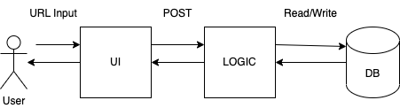

# MiniURL

Furious with copy pasting long URLs? Fret Not! With **MiniURL**, you can generate short and sweet URLs with the click of a button!

## How to use

1. Type or copy-paste the URL of your choice into the text box
2. Click **generate**
3. Click your newly generated MiniURL!

## Architecture

A **client-server** architecture was utilized

1. Users will interact with the React UI frontend, inputting their URL
2. URL is sent to Node.js backend, where it will be processed.
3. \[Extension\] The URL is stored in a MongoDB database to ensure consistency in MiniURLs
4. Generated/retreived MiniURL is sent back from backend, appearing in the UI for the user to click/copy
